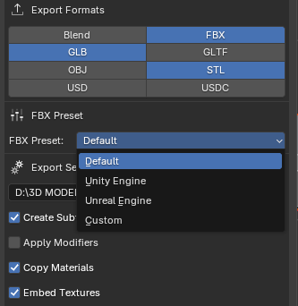
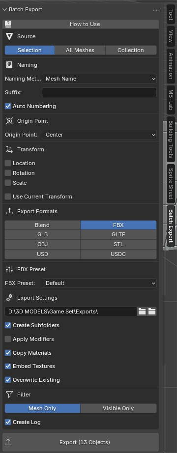
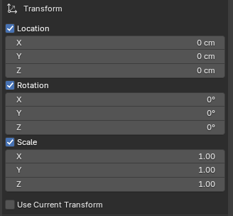
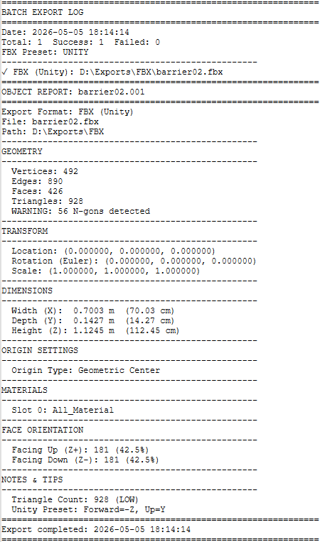

# BatchForge: Blender Batch Export Tool
BatchForge is a powerful, all-in-one batch export solution for Blender that streamlines the process of exporting multiple 3D assets with precise control over origin points, transforms, and output formats. Whether you're preparing assets for Unity, Unreal Engine, 3D printing, or archiving your work, BatchForge eliminates repetitive export tasks and ensures consistency across your entire assets.

## - Key Features
- Set Origin Point
Place any point of your mesh exactly at world origin (0,0,0) with six precision modes: Center - Bottom Center - Top Center - Center of Mass - Keep Original - World Origin

This is particularly valuable for game development where consistent pivot points are essential for proper instancing, snapping, and physics interactions.

## - Game Engine Presets
Export directly with optimized settings for major game engines:

Unity Engine : Automatic axis conversion (Forward: -Z, Up: Y) with baked space transform

Unreal Engine : Correct forward/up axis configuration

Custom : Manual axis control for any engine or DCC application

## - Multi-Format Export
Export each object simultaneously to multiple formats:

Blend - FBX - GLB/GLTF - OBJ - STL - USD/USDC

## - Transform Control
Reset Location/Rotation/Scale with custom values
Apply Scale - Automatically bakes object scale to mesh data while preserving visual dimensions
Use Current Transform - Keep scene position and rotation for level design workflows

## - Intelligent Naming
Mesh Name - Use object names as filenames
Custom Name - Prefix + Suffix - Auto Numbering - 

## - Flexible Source Selection
Selection - Export currently selected objects
All Meshes - Export every mesh in the scene
Collection - Export from specific collections for organized workflows

## - Detailed Export Reports
Generate comprehensive log files with:
Geometry statistics (vertices, faces, triangles)
Dimensions and volume information
Face orientation analysis
Material assignments
Export settings summary

### - Additional Features
Apply Modifiers - Copy Materials & Embed Textures - Create Subfolders - Progress Bar - Overwrite Protection

### - How to Use
Select your source - Choose between Selection, All Meshes, or a specific Collection

- Configure naming - Set your preferred naming convention
- Choose origin point - Select where the pivot should be placed
- Set transforms - Optionally reset or customize location, rotation, and scale
- Pick formats - Enable the export formats you need
- Select FBX preset - Choose Unity, Unreal, or Custom axis settings
- Set export path - Choose your output directory
- Click Export - BatchForge processes each object individually

## LOG SAMPLE

# - Smart Export Logging System
BatchForge includes a comprehensive logging system that generates detailed reports for every export operation. These logs go far beyond simple success/failure messages : they provide actionable insights into your 3D assets before they reach your game engine or production pipeline.

- What the Logs Track
Each exported object generates a detailed report containing:

Geometry Statistics : Vertex count, edge count, face count, and triangle count
Transform Data : Exact location, rotation, and scale values after processing
Dimensional Analysis : Width, depth, and height in both meters and centimeters
Material Inventory : All assigned materials and their slots
Origin Configuration : Which origin mode was applied
Export Settings : All active settings used for that specific export

## - N-Gon Detection & Warning System
- One of the most valuable features of the logging system is its automatic N-gon detection.
- N-gons (faces with more than 4 vertices) are a common source of problems in game engines and 3D applications.

What the system does:

-WARNING: 3 N-gons detected (faces with >4 vertices)
- The logger scans every polygon on your mesh and flags any face with more than 4 vertices.

This is critical because:

# Issue	Impact
- Game Engines: Unity and Unreal triangulate N-gons automatically, often with unpredictable results
- Lighting Artifacts	N-gons can cause strange shadow behavior and normal map issues
- UV Mapping	Complex N-gons frequently lead to UV distortion
- Collision Meshes	Physics engines struggle with non-planar N-gons
- 3D Printing	Slicers may misinterpret N-gon topology

How this saves you time: 
- Instead of discovering N-gon problems after importing into your game engine (where they cause visual glitches), you're alerted immediately during export. You can fix them in Blender before they become production issues.

## - Face Orientation Analysis
The logging system includes automatic face orientation analysis : a feature that detects potentially problematic backfaces before they cause rendering issues.

Sample log output:

FACE ORIENTATION
 - Total Faces: 3,456
 - Facing Up (Z+): 2,876 (83.2%)
 - Facing Down (Z-): 580 (16.8%)

Why face orientation matters:

- Backface Culling: Most game engines hide backfaces by default for performance. Faces oriented incorrectly will appear invisible.
- Normal Maps: Incorrect face normals cause lighting to behave unpredictably.
- Baking: Ambient occlusion and lightmap bakes produce artifacts on flipped faces.
- 3D Printing: Inverted normals tell the slicer that "inside is outside," causing failed prints.

### Automatic Warnings:
If more than 40% of faces are oriented downward, the logger displays:

- NOTE: High percentage of downward-facing faces detected
  Check face orientation in Edit Mode (Overlays > Face Orientation)
This proactive warning helps you catch orientation issues before they become "Why is my model invisible?" debugging sessions in Unity or Unreal.

- Performance Insights
The logging system provides triangle count categorization to help you optimize for different platforms:

NOTES & TIPS
  Triangle Count: 24,892 (MEDIUM)
  Suitable for most applications

  Triangle Count: 125,000 (HIGH)
  Consider creating LODs for game engines

  Triangle Count: 1,247 (LOW)
  Good performance expected
This instant feedback helps you make decisions about:
Whether an asset needs LOD (Level of Detail) versions
If a mesh is suitable for mobile platforms
When to split a complex object into smaller pieces
Budget allocation for scene polygon counts

## - Game Engine-Specific Insights
When using the Unity or Unreal FBX presets, the log includes engine-specific information:

FBX (Unity): D:\Exports\FBX\SM_Barrel.fbx
  Unity Preset: Forward=-Z, Up=Y
  Bake Axis Conversion: Yes
This confirms that the correct axis conversion was applied, eliminating the "Why is my model sideways in Unity?" confusion before it happens.

## - Log File Location
Logs are saved as timestamped text files in your export directory:

Exports/batch_export_log_20260506_143022.txt

Each log file contains reports for every object in that export batch, making it easy to:
- Track changes between export sessions
- Debug pipeline issues by comparing logs
- Document asset specifications for team handoffs
- Archive export history for version control

## - Technical Details
Logs are saved in UTF-8 plain text : readable by any text editor
Timestamp format: YYYYMMDD_HHMMSS for easy chronological sorting
Automatic generation : no extra steps required, just enable "Create Log"
Non-blocking : log generation does not slow down the export process
Privacy-conscious : logs contain only mesh data, no personal or system information

## - Summary
The BatchForge logging system transforms the export process from a "hope it works" black box into a transparent, verifiable workflow. By catching geometry issues, orientation problems, and performance concerns at export time, you eliminate the frustrating cycle of importing broken assets into your target application and backtracking to find the cause.
